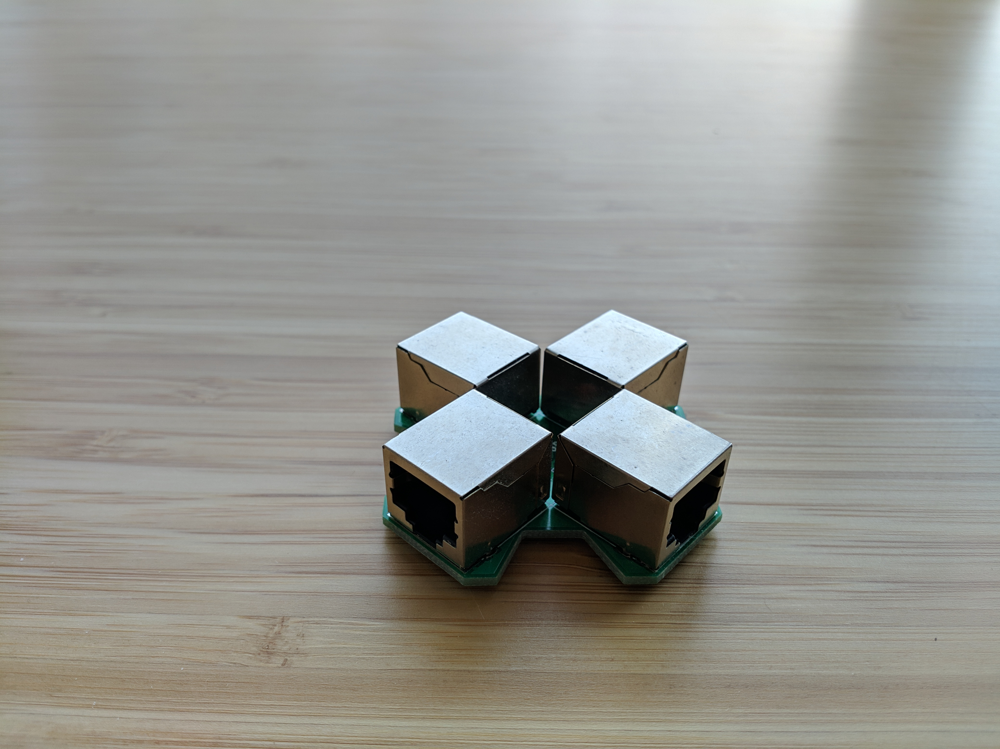

# Lan Tap
This repo contains the modified version of the Throwing Star LAN TAP to use the generic RJ45 connectors I bought from Ebay.

## Original README

Throwing Star LAN TAP
Copyright 2011 Michael Ossmann <mike@ossmann.com>
These design files are licensed under the terms in the file, COPYING.

parts required:
qty 4 RJ45 connectors: Amphenol RJHSE-5080 (unshielded) or RJHSE-5380 (shielded)
qty 2 220pF through-hole capacitors with .1" lead spacing (e.g. Xicon 140-50P2-221K-RC)

For more information: http://greatscottgadgets.com/
